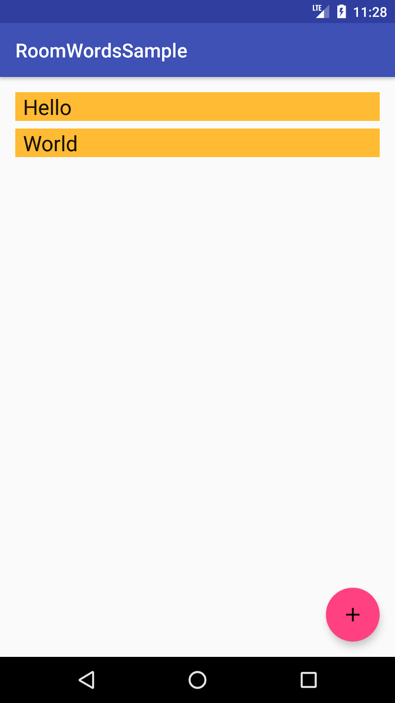
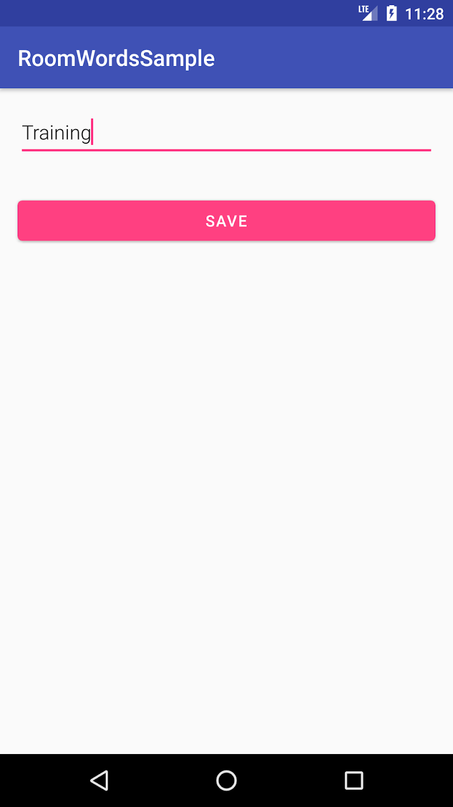
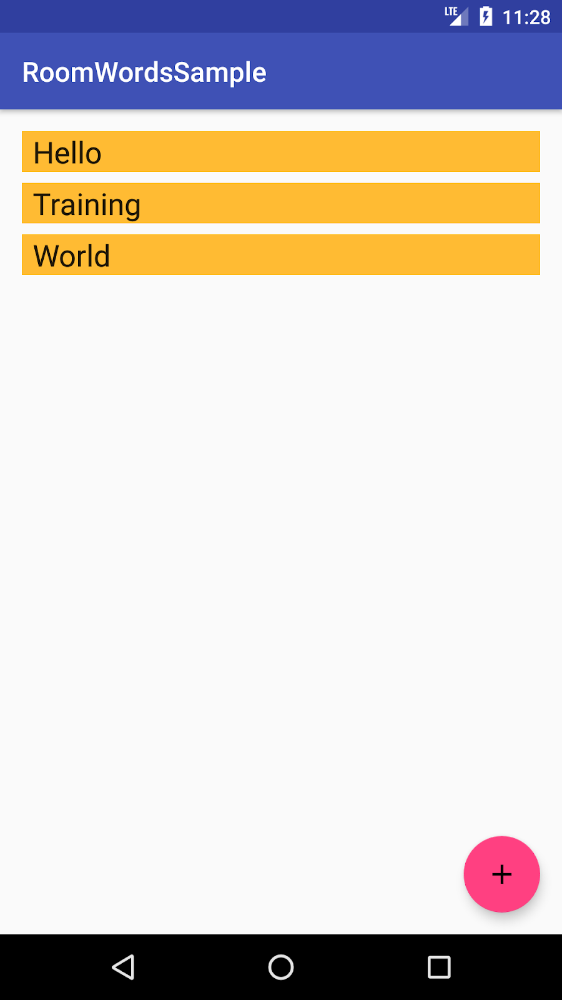

# HW_Week04_Day05
The Home Work has to be delivered before 9AM ⚠️
# What you'll do 📋
## You'll learn how to design and construct an app using the architecture components Room. Your app will:
- work with a database to get and save data, and pre-populate the database with sample words.
- display all the words in a `RecyclerView` in the `MainActivity` class.
- open a second activity when the user taps the + button. When the user enters a word, that word is added to the database and displayed in the `RecyclerView` list.

## The app is no-frills, but sufficiently complex that you can use it as a template to build upon. Here's a preview:

  |   |  

# Learning Resources  📚
* [Android Recyclerview](https://developer.android.com/guide/topics/ui/layout/recyclerview)
* [Android room database](https://developer.android.com/training/data-storage/room)

